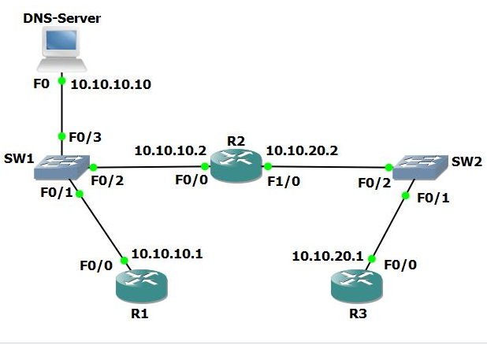

## Cisco Routing:  DNS and ARP exercise.

Today we will be configuring routers R1, R2 and R3 to a DNS located at 10.10.10.10. The domain-name and domain-list has already been configured for us before.
The diagram we will be following is this:

To begin the method we will be following to configure the routers at this point is very straight forward and is as follows.

In the CLI we first need to enable our router via `Enable`

Enter to configuration terminal via `Config T`  or `Config Terminal`

Use `ip domain-lookup`  to specify that the router is going to use a DNS server.

and then we use `ip name-server 10.10.10.10` to specify where the DNS server is.

And that's it! We just need to `end` and that would allow our router to connect directly to our DNS server on a Cisco product.

##

The next step is to run the `ping` command from R1 to R2 to R3 to see if the routers con communicate together.

We can now run `show arp` command from each of the routers to see what ARP cache are generated which are located on all hosts that are directly connected networks.

From R1 we can see the ARP table which includes but DNS and R2 but no information on R3 because it is not directly connected to each other.

In R2 we can see its directly connected to R1, R3, and the DNS Server.

In R3 we only have one direct connection to R2.

And that's it!

