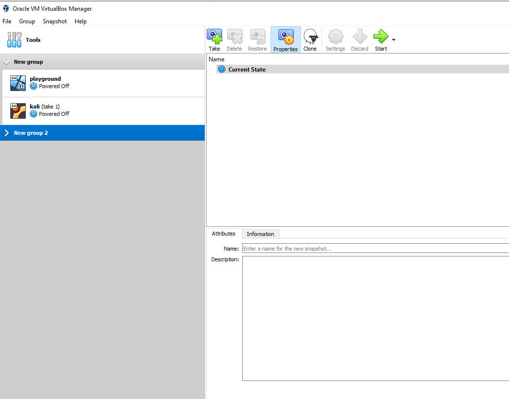
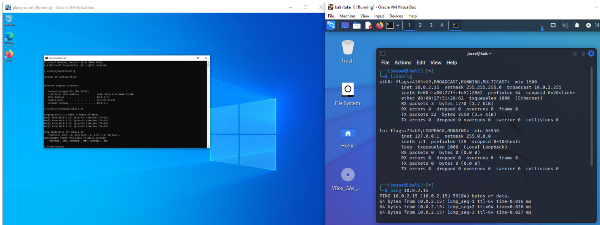
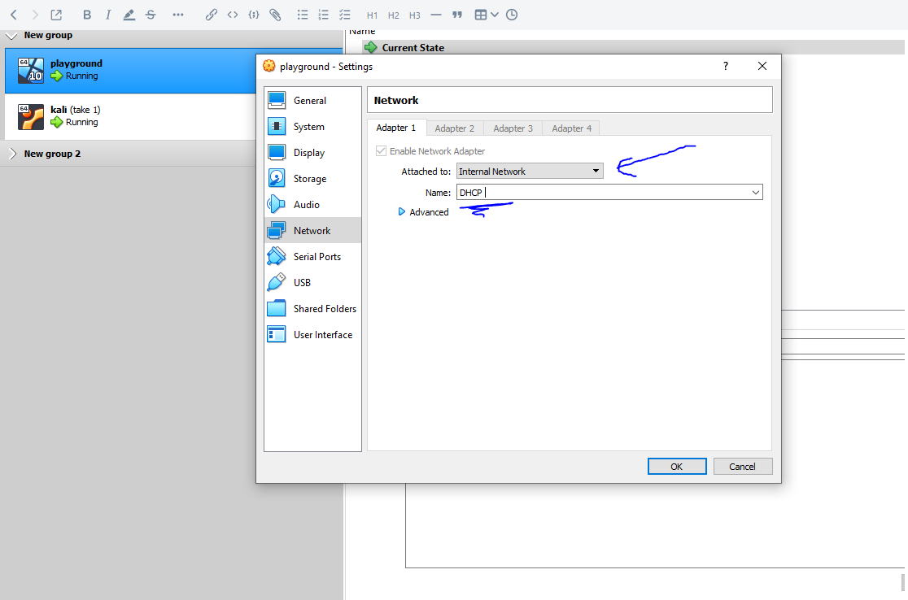
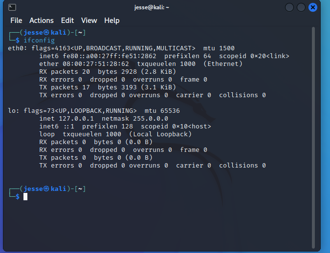
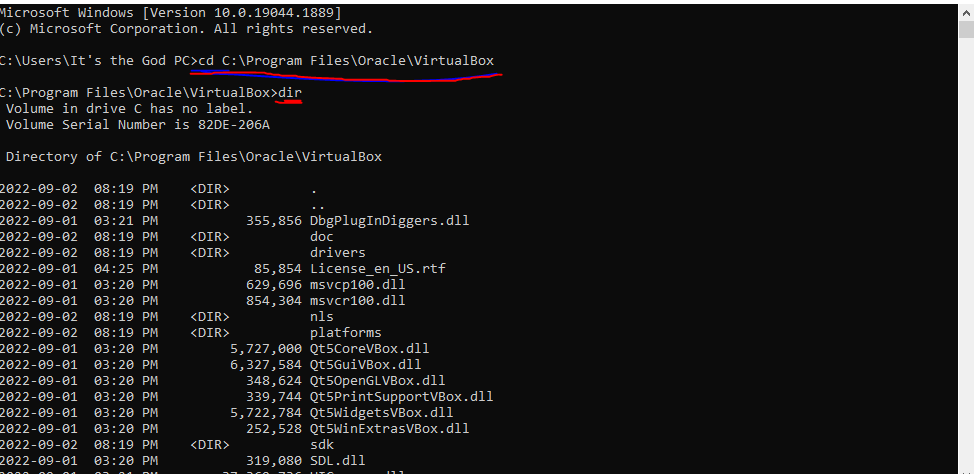
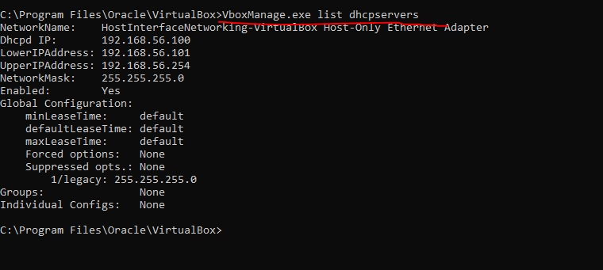
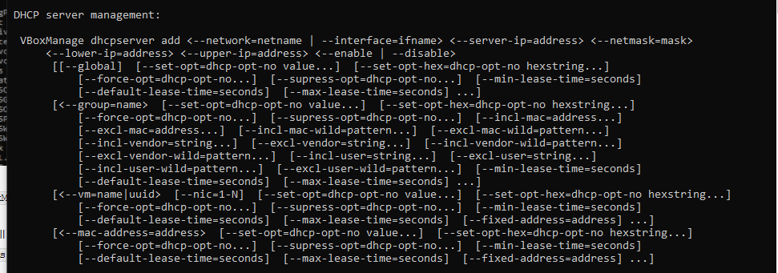
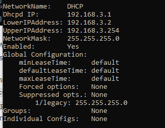
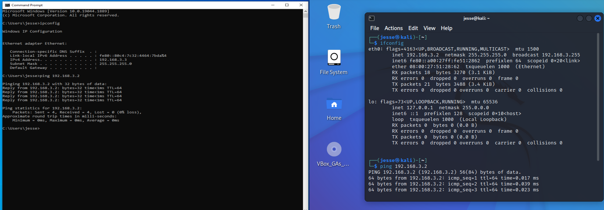

## Creating and configuring a DHCP server on Virtual Box

Today we are going to take a stab at making our own DCHP in Virtual box.

I've set up 2 virtual machines (VM) containg two different OS. One is Windows 10 and the other is Kali Linux.

The goal here is to have them connect and talk to each other on a network that is not connected to the the internet. 

At this point of time, although the VMs are situated on my NAT configuration with my personal computer. As you can see, if I ping from each machine you can see that they can communicate together already. 

Although this is great, I also want this entire network to be secured and isolated from other VM's so that I can play around test things on a seperated environment. So a solution to this is to create an internal network that has  **DHCP serve**r to automatically assign a unique IP to each VM.

## Adjusting Network settings for each Virtual Machine

I first start off with going into the settings of each virtual machine and changing the settings from `NAT`  to `Internal Network` and configuring a name that I think is appropriate in this case it will be "DHCP" - not the most imaginative but it helps. 

Now since both VM machines are now configured the same, we can see if each machine has access to the web or if they ping each other. 

Since there is no DHCP server to assign IP addresses the Win 10 VM had to autoconfigure its own IPv4 address of `169.254.123.218` while for the Kali VM we can see that instead of an autoconfiguration, the system just uses the local host address `127.0.0.1`. If we try the `ping`  command to each other as we did earlier; we get dropped packets because the two VMs are now unable to connect and communicate to each other.

## Creating the DHCP Server in Virtual Box
So now its the time to create a DHCP server and configure it so that it distributes IP addresses to our machines.

The first step is to locate the directory the VirtualBox is located on on my host computer and copy its path.
In my case its found here `C:\Program Files\Oracle\VirtualBox`

Opening up command prompt I need to navigate to the directory using the `cd` command using that path. Once that is done I can use `dir` to list all the availiable directories that are in this path. 

What we need to do is to locate `VboxManage.exe` and do some wizardry to finally configure our DHCP server. 

First command I want to do is to list all the curent DHCP servers that exists using 
`VboxManage.exe list dhcpservers`

Here we can see there is one already but it doesn't match our network id that we made for the VM's as seen earlier in VirtualBox. 

We now need to figure out what the commands are needed to set everything up. To do this we can simply call VboxManage.exe in the command prompt and scroll down to a section called `DHCP server management` 

Here are all the relevant commands. We can use this info to configure the whole DHCP server very easily, just a simple subnet and we will have our server IP, subnet mask, first host ip and last host ip. 

Everything can be simplied in this command :
`VBoxManage dhcpserver add --network=DHCP --server-ip=192.168.3.1 --netmask=255.255.255.0 --lower-ip=192.168.3.2 --upper-ip=192.168.3.254 --enable`

It's important to note that my network name need to be the same as the one I configured earlier for the VMs otherwise it wont work properly.

and **boom** we have  DHCP server configured assuming we didnt make any typos or configurational errors!

Lets revisit the command `VboxManage.exe list dhcpservers`  to see if  our new server is listed in `VboxManage.exe`

and indeed it is!

OK now all we need to do is check if our VM's can talk to each other and that their IP address' lay between our specified address. The easiest way to do this is send a ping command to between the two. 

And EVERYTHING WORKS! The Windows machine was assigned the IP `192.168.3.3`  while the Kali VM was assigned  `192.168.3.2` which is PERFECT. When I go to ping between the two machines the Windows VM was able to ping Kali no problems. But when I pinged Kali to Windows VM's there were slight hiccups. This was due to the fact that Windows has a firewall that blocks inbound ICMP packets. Simply adjusting the firewall inbound rules allowed Kali to ping perfectly to the Windows VM.

And there you have it! This is how I configured a DHCP server in Virtual Box..

